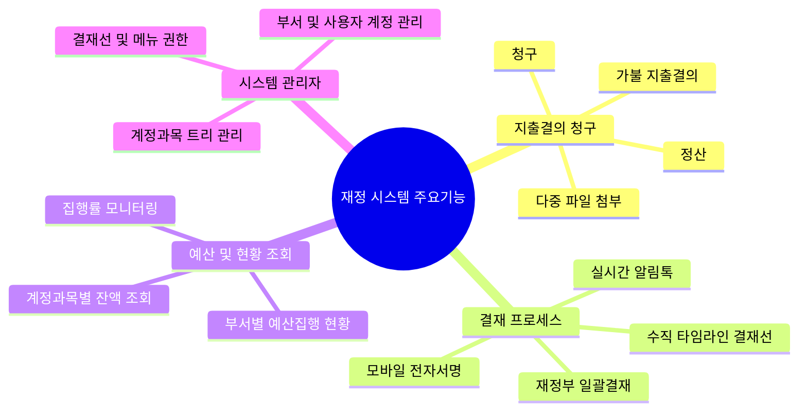
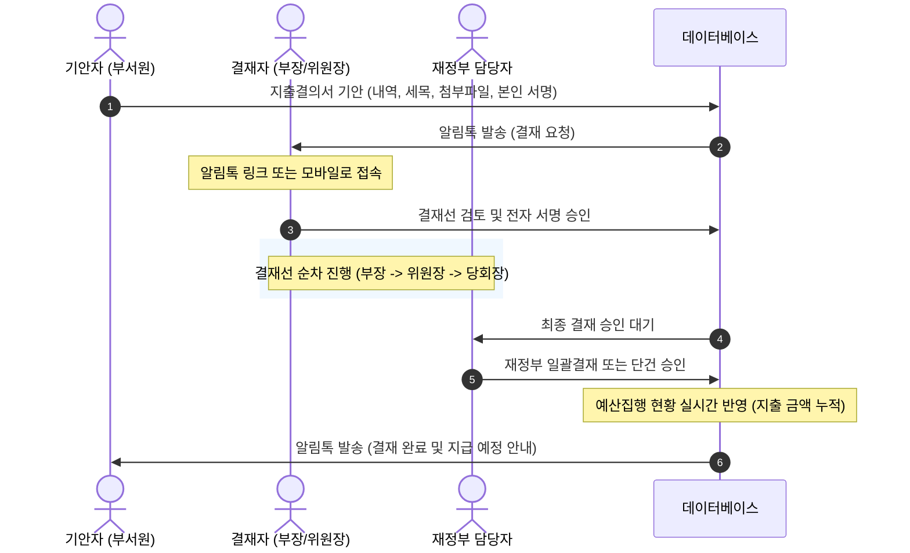

# 원천교회 재정부 지출청구 및 예산관리 시스템 소개

> **본 문서는 원천교회 재정 청구 및 예산 관리 시스템의 원활한 이용을 돕기 위해 작성된 사용자 가이드라인입니다.**
> 각 슬라이드(Slide) 구분을 통해 발표 장표 또는 매뉴얼 형태로 가독성 있게 구성되었습니다.

---

## 🖥️ Slide 1. 시스템 개요 및 도입 배경
### **"종이 없는 재정 관리, 투명하고 신속한 결재"**

원천교회 재정부 지출청구 및 예산관리 시스템은 기존의 종이 영수증 첨부와 수기 결재 방식에서 벗어나, **모든 청구·정산·결재 및 예산 집행 현황을 온라인으로 통합 관리**하는 디지털 재정 행정 시스템입니다.

```
┌──────────────────────────────────────────────────────────────┐
│                  Woncheon Finance Portal                     │
│  [지출결의서 작성] ──► [역할별 온라인 결재] ──► [실시간 예산 연동] │
│      (PC/모바일)           (담당/부장/위원장/당회장)      (계정과목별 집행률)     │
└──────────────────────────────────────────────────────────────┘
```

#### **핵심 가치**
*   **신속성**: 시공간의 제약 없는 모바일 결재 및 알림톡 실시간 전송
*   **투명성**: 모든 결재 이력 및 결재자 서명 내역의 영구 보존
*   **정확성**: 부서별/계정과목별 예산 집행률 실시간 통제 및 초과 방지

---

## 🌟 Slide 2. 시스템 주요 특장점 (Key Advantages)

본 시스템은 사용자의 편리성과 재정 관리의 무결성을 극대화하기 위해 다음과 같은 특장점을 제공합니다.

| 구분 | 주요 특징 | 상세 설명 |
| :--- | :--- | :--- |
| **📱 완벽한 모바일 연동** | 언제 어디서나 결재 | PC와 동일한 기능의 모바일 웹을 제공하여 이동 중에도 기안 확인 및 서명 승인이 가능합니다. |
| **💬 알림톡 실시간 연동** | 지연 없는 의사소통 | 결재 요청, 반려, 최종 완료 시 카카오 알림톡이 자동으로 발송되어 업무 누수를 방지합니다. |
| **🔒 데이터 무결성 보장** | 서명 중복 방지 로직 | 인덱스(idx) 기반 서명 매칭 기술로 동일 부서/역할 내 중복 결재선 지정 시에도 서명이 꼬이지 않습니다. |
| **📊 실시간 예산 통제** | 예산 대비 집행 실시간 조회 | 각 부서가 청구서를 기안할 때 예산/지출/잔액/집행률을 실시간으로 확인하여 예산 범위 내 지출을 유도합니다. |

---

## 🛠️ Slide 3. 시스템 주요 기능 일람

원천교회 지출청구 시스템은 크게 **청구/결재/조회/관리** 영역으로 나뉩니다.



*   **지출결의 작성**: 청구(일반), 정산(가불금 정산), 가불(사전 지급 요청) 작성
*   **결재 타임라인**: 결재 흐름을 시각적으로 보여주는 수직 타임라인 기반 결재 상태 확인
*   **예산 및 집행 현황**: 예산 한도 내에서 지출이 이뤄지도록 계정과목별(관·항·목·세목) 실시간 잔액 표시

---

## 👤 Slide 4. [역할별 가이드] 1. 기안자 (부서원/담당자)
### **"간편한 지출결의서 작성 및 청구"**

부서의 예산 집행을 위해 지출결의서를 작성하고 청구하는 담당자의 프로세스입니다.

```
[1. 청구유형 선택] ──► [2. 내역 및 세목 선택] ──► [3. 파일 첨부] ──► [4. 서명 후 결재요청]
```

#### **상세 사용 방법**
1.  **로그인**: 부여된 부서와 사용자 정보를 선택한 뒤 패스워드를 입력하여 로그인합니다.
2.  **유형 선택**: **청구 / 정산 / 가불** 중 지출 유형을 선택하고, 영수인(Payee) 정보를 입력합니다.
3.  **지출내역 입력**: 관 · 항을 선택한 뒤 **목 · 세목**과 금액을 입력합니다. (세목은 필수 항목)
4.  **파일 첨부**: 영수증 등 증빙 서류를 첨부합니다. (개별 파일 **10MB**, 총합 **50MB** 한도, 다중 선택 지원)
5.  **확인 및 서명**: 최종 확인 탭에서 본인 서명을 캔버스에 등록하거나 기본 서명을 불러와 **결재요청**을 누릅니다.

> [!TIP]
> **청구 수정/삭제 규칙**: 본인이 기안한 문서는 결재가 진행되기 전(최초 결재자가 승인하기 전 기안 단계)에 한해 자유롭게 수정 및 삭제가 가능합니다.

---

## ✍️ Slide 5. [역할별 가이드] 2. 결재자 (부장/위원장/당회장)
### **"모바일 지원으로 신속하고 간편한 결재 승인"**

기안된 지출결의서를 검토하고 온라인으로 승인 또는 반려하는 의사결정권자 프로세스입니다.

#### **결재선 구성 및 시각화**
*   **순차 결재선**: `담당(기안자) ➡️ 부장 ➡️ 위원장 ➡️ 당회장` 단계별 결재
*   **결재선 시각화**: 기안자 및 이전 승인자는 **흐리게(Dimmed)** 표시되고, 현재 결재 차례인 사용자는 **강조 표시**되어 현재 병목 단계를 한눈에 식별할 수 있습니다.

#### **결재 처리 방법**
1.  **알림톡 확인**: 결재 차례가 되면 카카오 알림톡으로 청구 부서, 기안자, 금액 정보와 결재 링크가 발송됩니다.
2.  **내역 검토**: `내결재목록 조회` 화면에서 청구 상세 정보와 첨부된 영수증 이미지를 검토합니다.
3.  **승인/반려**:
    *   **승인**: 결재 의견을 입력하고 서명(캔버스 직접 작성 또는 기본 서명) 후 **승인** 버튼을 클릭합니다.
    *   **반려**: 반려 사유를 상세히 입력한 뒤 **반려** 버튼을 클릭합니다. (기안자에게 즉시 반려 알림톡이 전송됩니다.)

> [!NOTE]
> **결재선 최적화**: 결재선에 지정된 결재자가 단 1명인 경우, 체크박스 등 불필요한 UI 요소를 생략하여 혼선을 최소화했습니다.

---

## 💰 Slide 6. [역할별 가이드] 3. 재정부 담당자
### **"최종 승인, 일괄 결재 및 완벽한 예산 모니터링"**

교회 전체의 재정을 최종 집행하고 예산의 통제 및 현황을 관리하는 재정부 사용자용 프로세스입니다.

#### **1. 최종 결재 및 일괄결재 처리**
*   **즉시 결재완료**: 재정부 부서원이 직접 기안하는 문서는 별도 승인 단계 없이 **기안과 동시에 즉시 승인 완료** 처리됩니다.
*   **일괄 결재 (`/bulkApproval`)**: 수많은 청구 건을 하나씩 열어보지 않고 기간·부서 필터링을 통해 대기 목록을 조회한 뒤, **일괄 선택 ➡️ 일괄 서명 ➡️ 일괄 승인**으로 한 번에 처리합니다.

#### **2. 예산 및 과목 관리**
*   **예산 등록 및 관리 (`/budgets`)**: 회계연도별, 부서별 계정과목 예산액 수립 및 등록
*   **계정과목 트리 관리 (`/accountCategories`)**: 관·항·목·세목 체계를 트리 구조로 추가/수정/삭제
*   **예산집행 현황 모니터링 (`/budgetStatus`)**: 전 부서의 실시간 예산 대비 집행률, 잔액, 지출 추이를 모니터링하여 예산 조기 소진 방지

---

## 🔑 Slide 7. [역할별 가이드] 4. 시스템 관리자
### **"안정적인 시스템 운영을 위한 마스터 권한 관리"**

부서, 사용자 계정, 시스템의 권한 체계 등 백오피스 관리를 총괄하는 관리자 프로세스입니다.

#### **주요 관리 업무**
1.  **사용자 및 서명 관리 (`/userManagement`)**:
    *   신규 사용자 등록 및 정보 수정 (아이디, 비밀번호, 소속 부서, 역할 설정)
    *   사용자별 기본 서명 이미지 등록 상태 관리 및 비밀번호 분실 시 초기화(4자 이상) 지원
2.  **부서 관리 (`/departments`)**:
    *   조직 개편 시 부서 트리 구조를 통한 상위/하위 부서 등록, 수정, 삭제 및 부서코드 부여
3.  **결재선 기본 템플릿 관리 (`/approval-lines`)**:
    *   부서별 결재 경로(담당 ➡️ 부장 ➡️ 위원장 등)의 기본값 설정 및 매핑
4.  **메뉴 접근 권한 제어 (`/roleAccess`)**:
    *   역할(Role)에 따른 메뉴 노출 및 접근 권한 통제

---

## 🔄 Slide 8. 전체 업무 프로세스 흐름도 (Workflow)



---

## 📢 Slide 9. 시스템 이용 주요 규칙 및 팁 (Rules & FAQ)

*   **⏱️ 보안을 위한 자동 로그아웃**: 로그인 후 **5분 동안 마우스 움직임이나 키보드 입력 등 활동이 없으면** 안전한 재정 정보 보호를 위해 세션이 자동 만료되며 로그아웃 페이지로 이동합니다.
*   **🎯 모바일 플로팅 메뉴 버튼**: 모바일 기기로 접속 시 화면 좌측에 `MENU` 탭이 생성됩니다. 이 탭을 **상하로 길게 드래그**하여 본인이 사용하기 편한 위치로 이동시킬 수 있으며, 탭 위치는 로컬에 자동으로 저장됩니다.
*   **📑 직접입력 계정(기타)**: 결재서 기안 시 사전 등록된 계정과목을 찾지 못해 "직접입력"으로 기안한 금액은 예산 현황판에서 **기타(ETC) 지출**로 누적 관리됩니다.
*   **📎 증빙 파일 용량 제한**: 서버 부하 및 보안 관리를 위해 증빙 첨부 파일은 **개별 파일 최대 10MB**, **모든 파일 합산 최대 50MB**까지만 업로드할 수 있습니다.
